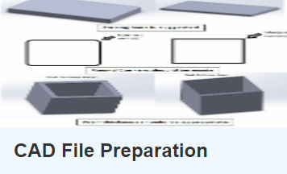
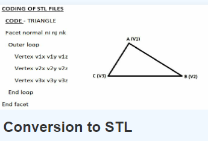
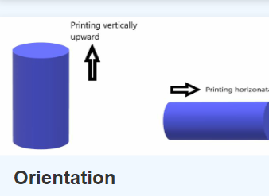
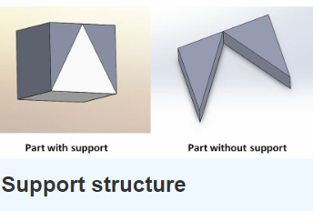
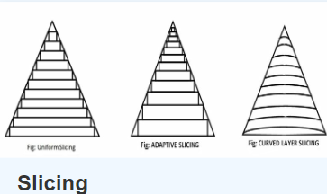
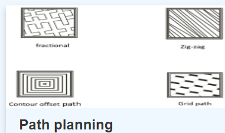

# Ex. No. 7 - SIMULATION OF PRE PROCESSING IN ADDITIVE MANUFACTURING
### DATE: 25-11-2023
## AIM:
### To simulate the Pre Processing for 3D printing.

## REQUIREMENTS:
### System - Windows 7 or higher, 1 GB RAM.

## PROCEDURE:
### Pre-processing encompasses the steps between design and printing. Process of 3D printing starts with designing in CAD. Then printer software slices 3D CAD file into layers. For each slice, the software converts the data into machine code that determines tool paths for the machine to follow. The various steps in pre-processing from design to printing are as follows:

### 1)	CAD File
### 2)	Conversion to STL a. Orientation b. Support Structure c. Slicing d. Path Planning

### 1. CAD File
### Every manufacturing process starts with the process of designing and as in any type of manufacturing, there are certain limitations to the materials and manufacturing processes that dictate how the product should be designed, 3D printing is no different. In 3d printing, characteristics of hardware, software, temperature, filament and many other factors play an important role in how a digital model translates into a printed object. Some of them are designed with a strong base, grain direction, overhung, wall thickness, round corners and tolerances.

### 2. Conversion to STL
### In order to check the interface of the object and make it reliable to 3d printers, conversion to STL file is required. It also facilitates other features like quick error check, bridging the gap between CAD platforms, exhibition purposes and 3D digitizer extension.

### a. Orientation:
### Orientation plays a vital role in the final product of 3d printing as it affects the part accuracy, manufacturing time, strength and surface finish. There are various orientations by which we can print the object such as vertically upward, vertically downward and in horizontal plane.

### b. Support Structure:
### Support structures are required where the objects are unable to get printed directly. Support structures help to guarantee the printability of a section during the 3D printing measure and also it can assist with forestalling part twisting, secure a section to the printing bed and guarantee that parts are joined to the fundamental body of the printed part.

### c. Slicing:
### The motive behind slicing a 3D model is to transform the model into guidelines for the 3D printer. To play out this errand, the slicing software isolates the item into numerous layers. It's classified "slicing" since it "slices" the 3D model to make numerous layers. After the layers have been made, the slicing software applies different qualities to every one of them.

### d. Path Planning:
### Path planning helps to improve the printed surface quality, shape accuracy and infill distribution quality. There are various ways for path planning which can be used to print the objects which may affect the following factors in objects like raster path, grid path, spiral path and zigzag path.

### ●	All the processes related to pre-processing will be shown on the screen.
### ●	Select CAD file preparation from the visible list.
### ●	When the first process is selected then it will open in the blank space in the left side of the screen.
### ●	Select the options of process of pre-processing in the sequence in which they are shown.
### ●	If the user follows an incorrect sequence then a pop-up will appear on the screen showing the name of the process to be selected.

## OUTPUT:
## CAD FILE PREPARATION :

## strong base is suggested :
Having a strong base or foundation is essential in the preprocessing stage for 3D printing because it helps ensure the stability and integrity of the printed object throughout the printing process

## round corners should be made :
Sharp corners can act as stress concentration points, making the printed object more susceptible to failure or breakage. By rounding the corners, you distribute the stress more evenly across the object, reducing the likelihood of structural issues.

## wall thickness should be appropraite :
By ensuring an appropriate wall thickness during preprocessing, you can achieve a balance between structural integrity, printability, and material considerations. This leads to a successful 3D print with the desired strength, accuracy, and functionality.

## CONVERSION OF STL:

## coding of stl files :
coding for STL file preprocessing empowers you with greater control, efficiency, and flexibility in preparing 3D models for printing. It enables automation, customization, and scalability while ensuring consistency and integration within your 3D printing workflow.

## ORIENTAION:

## printing verticlly upward and printing horizontolly in 3d printing :
Vertical surfaces generally have better surface finish compared to horizontal surfaces, as the layers are stacked vertically, reducing the visibility of individual layer lines.

## SUPPORT STRUCTURE:

## part with support :
A "part with support" in the preprocessing stage of 3D printing refers to a 3D model that requires the addition of support structures to ensure successful and accurate printing of certain features

## part without support :
A "part without support" in the preprocessing stage of 3D printing refers to a 3D model that does not require the addition of support structures during the printing process. In other words, the design of the part is such that all features can be printed without the need for additional support material.

## SLICING:

## Uniform slicing :
also known as uniform layer height or uniform layer thickness, refers to a preprocessing technique in 3D printing where the model is sliced into layers of consistent thickness throughout the entire object

## Adaptive slicing :
It is a preprocessing technique in 3D printing where the layer thickness varies throughout the object based on the geometry and level of detail required. Instead of using a uniform layer thickness, adaptive slicing adjusts the layer thickness dynamically to optimize the print quality and printing time

## Curved layer slicing :
It is also known as adaptive layer height or variable layer height, is a preprocessing technique in 3D printing where the layer thickness varies along curved or sloping surfaces of a 3D model.
## PATH PLANNING:

## Fractional path planning :
It is also known as fractional layering or non-integer layer heights, is a technique used in 3D printing to achieve finer resolution and improve the surface quality of printed objects

## Zigzag path planning :
It is a technique used in 3D printing to optimize the movement of the print head or extruder during the printing process. Instead of following a straight path for each layer, zigzag path planning involves printing each layer in a zigzag pattern, alternating the direction of movement.

## Contour offset path :
It is lso known as offsetting or offsetting contours, is a preprocessing technique used in 3D printing to create multiple concentric copies of a 2D or 3D shape with increasing or decreasing dimensions

## Grid path planning :
It is also known as grid infill or grid pattern, is a technique used in 3D printing to fill the interior of a 3D model with a grid-like pattern

## Output:

### Name:D.B.V.SAI GANESH
### Register Number:23009248

## Result: 
### Thus the simulation on the Preprocessing in additive manufacturing is completed.
